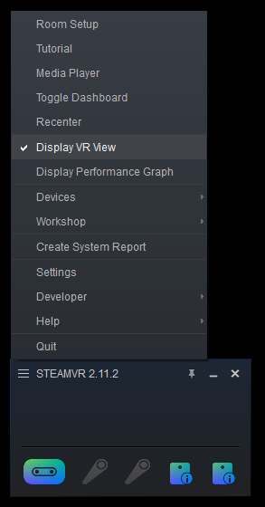
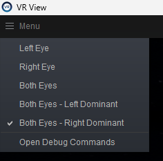
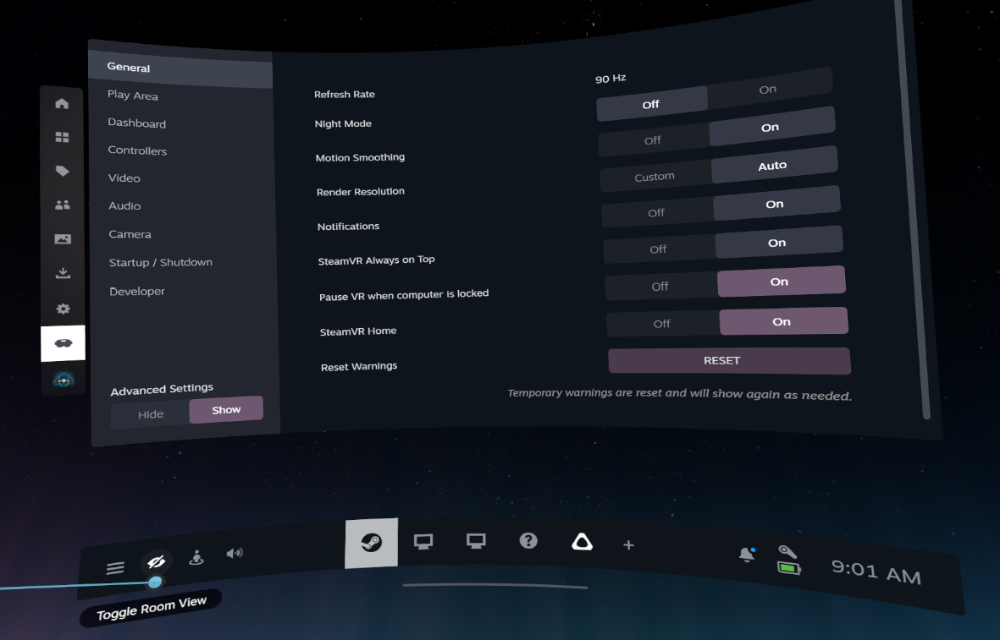
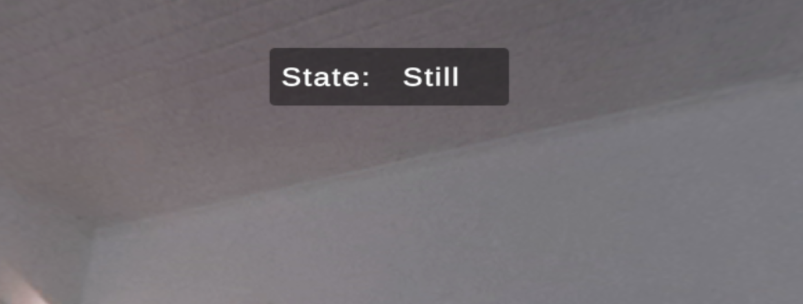

# HMD Face Recognition System

This repository contains a prototype that shows how face detection and recognition can be visualized directly inside a VR headset.  A small Python application performs the heavy lifting of detecting faces on a SteamVR-View window mirroring the HMD view and matching them against a database.  A Unity project receives the recognition results via UDP and renders a frame and the detected name around each head in 3D space.

## Project Walkthrough

For a complete explanation of the project, including the motivation, architecture, face recognition pipeline, Unity integration, and VR visualization, watch the project walkthrough below.

<p align="center">
  <a href="https://www.youtube.com/watch?v=bnxuZikzapA">
    
  </a>
</p>

<p align="center">
  <a href="https://www.youtube.com/watch?v=bnxuZikzapA">
    Watch the full project walkthrough on YouTube
  </a>
</p>

## Project Walkthrough

For a complete explanation of the project, including the motivation, architecture, face recognition pipeline, Unity integration, and VR visualization, watch the project walkthrough below.

[](https://www.youtube.com/watch?v=bnxuZikzapA)

[Watch the full project walkthrough on YouTube](https://www.youtube.com/watch?v=bnxuZikzapA)
## Overview

1. **Python face detection and recognition**
   - The SteamVR-View window is captured using `mss` and converted to RGB for further processing.
   - Faces are detected with **MTCNN**.  Each detected face is cropped and converted to a tensor that is passed to the face recognition model.
   - A pre‑trained **PocketNet S128** model generates embeddings which are compared to templates stored in an SQLite database.  Only the model path and threshold are configurable here – the actual PocketNet implementation is left untouched and has its own documentation.
   - For every frame a JSON payload with normalized face centre, size, color and name is sent to Unity via UDP.

2. **Unity visualization**
   - Unity listens on the UDP port and spawns a `FaceUI` object for each unique name received.
   - `FaceUIManager` creates OpenVR overlays that draw a rectangular frame and a name label in the headset.
   - Face positions are updated whenever a new UDP packet arrives while the headset is not moving.

3. **HMD movement handling**
   - `FaceTrackingManager` tracks the headset rotation and keeps a simple state machine with two states: **Moving** and **Still**.
   - When the headset rotates quickly, the state switches to *Moving* and existing face overlays keep their last position, effectively locking them in world space.
   - Once the headset is still for a short time, the state returns to *Still* and incoming face data once again updates the overlay positions each frame.

## Repository layout

- `src/face_detection/MTCNN_FD.py` – captures the chosen window, performs detection and recognition and sends UDP packets to Unity.
- `src/face_recognition/pocketnet_face.py` – wrapper around the PocketNet S128 model used to generate embeddings.
- `src/db/db_manager.py` – SQLite database helper to register users and fetch their templates.
- `src/Unity Project/HMD_FaceRecognition` – Unity project that visualizes the received faces in VR.
- `src/main.py` – entry point that starts the Python overlay and selects the target window to capture.

## Getting started

1. Install Python dependencies:

```bash
pip install -r requirements.txt
```

2. (Optional) Register example images as users:

```bash
python src/db/db_manager.py
```

3. Make sure **Steam** is running and **SteamVR** is installed and calibrated. Open the Unity project in the `src/Unity Project/HMD_FaceRecognition` folder. After opening it attempts to initialize or detect **SteamVR**. In the SteamVR menu you need to check the "**Display VR View**" option:




This should open a window mirroring the VR content. On the top left menu in this window you need to select "**Both Eyes - Right Dominant**" so the centering of the faces works as calibrated: 



In VR after pressing the **System button** (the bottom-most thumb button on the controller) you should see a window appearing right in front of you and more importantly a task bar at the bottom:



You want to **Toggle Room View** by pressing the **eye icon button** on the left of the taskbar. This should enable the passthrough and you should see your surroundings. To close the window, point the controller indicator at the background (not at any window) and press the index finger button. The window and the taskbar should disappear (pressing the System button will bring them back).

Now you can press **Play** in Unity. A new HUD element should appear in VR displaying the current state ("moving"/"still"):



4. Launch the Python overlay:

```bash
python src/main.py
```

As the Python script packets are received in unity, you will see colored frames and names appear around each detected face in VR.

GPU acceleration is used automatically when CUDA is available.
